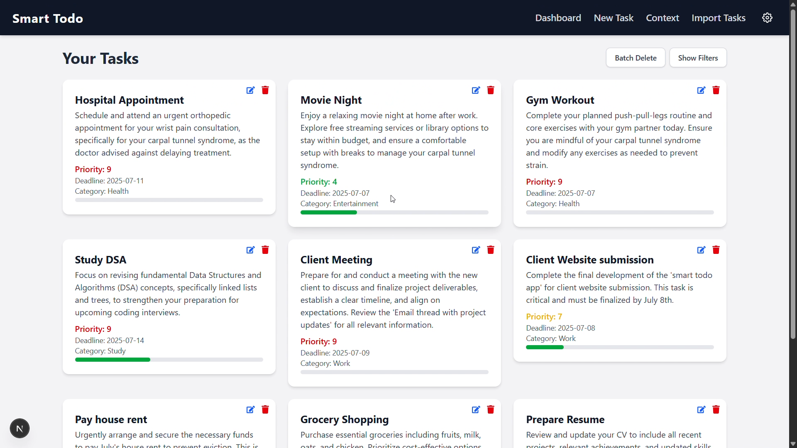
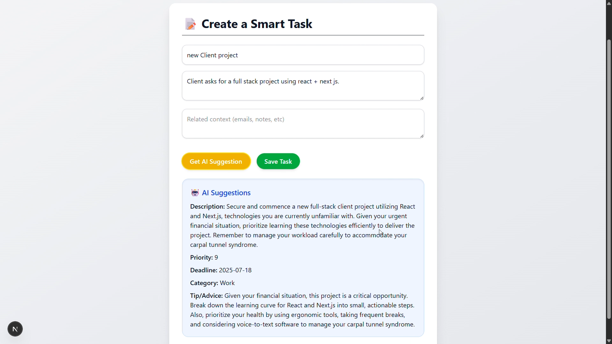
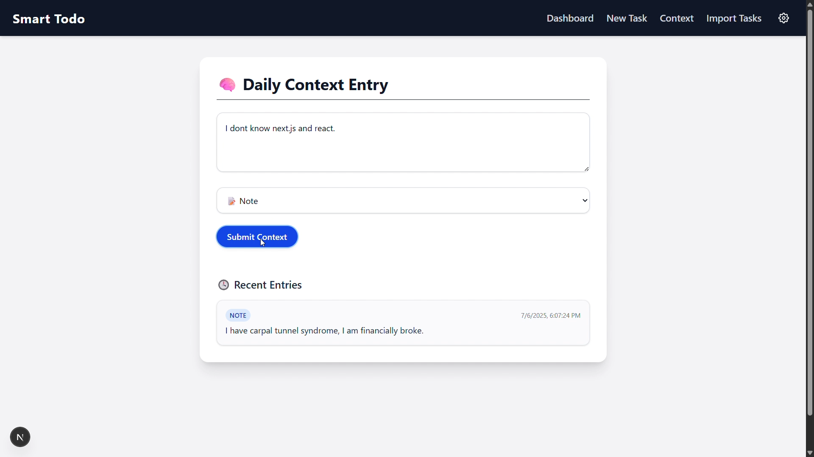
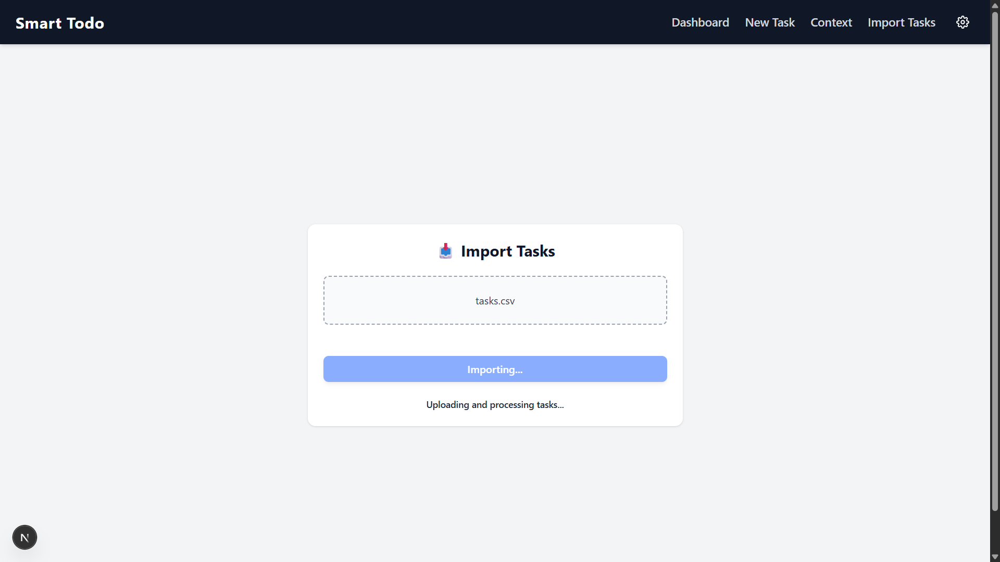
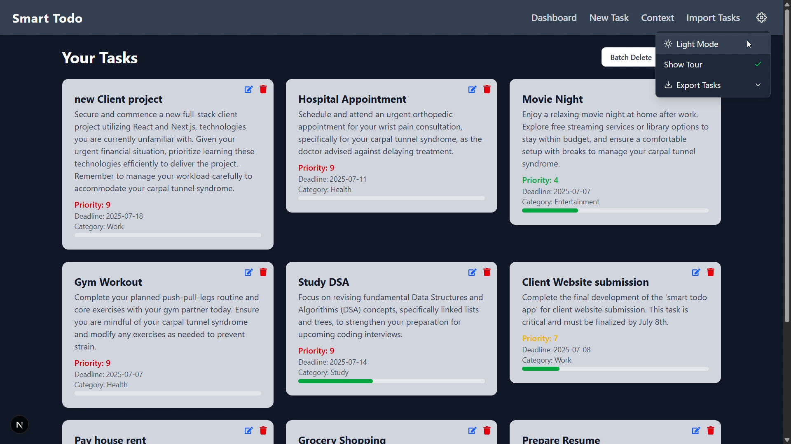

# 🧠 Smart Todo App

An AI-powered task management system that intelligently prioritizes,advices and enhances your tasks based on your daily context and workload.

Built with **Next.js + Tailwind CSS** on the frontend, **Django REST API** on the backend, and enhanced using **Gemini 2.5 Flash** for AI-based suggestions. Data is stored in **Supabase PostgreSQL** (You can use any DB).

---

## 🎯 Objective

To Smart Todo List application where users can manage their tasks with AI-powered features like task prioritization, deadline suggestions, and context-aware and personalized recommendations. The system should use daily context (messages, emails, notes) to provide intelligent task management suggestions.

### Features:
- Understands task and general context (email, notes, WhatsApp logs)
- Assigns intelligent priority score and deadlines
- Enhances user-entered task descriptions
- Categorizes tasks
- Warns users of workload clashes
- Dynamically reprioritizes all tasks in real time
- Offers productivity advice and tips

---

## 🎥 Demo

### Screenshots

| Feature | Screenshot |
|---------|------------|
| Dashboard |  |
| Task Creation |  |
| Context |  |
| Import |  |
| Dark Mode |  |

### Video Demo

[](https://youtu.be/qe6HLa059co)

*Click the image above to watch the demo video (3 mins)*


## 🖥️ Frontend (Next.js + Tailwind CSS)

### Features:
- Clean UI with **dark/light theme toggle**
- Navbar
- Dashboard
- AI-enhanced task creation form
- Context input page
- Import/export CSV/JSON functionality
- Task edit/delete modals
- Tour (haven't implemented)


### Pages:
- `/` Dashboard listing all tasks
- `/task` Create task (with Gemini AI suggestions)
- `/context` Enter daily context entries (any information about yourself which helps)
- `/import` Import tasks from CSV/JSON files

---

## 🔧 Backend (Django + DRF + Supabase PostgreSQL)

### API Endpoints:
- `/api/tasks/` → List all tasks
- `/api/tasks/create/` → Create a new task
- `/api/tasks/<id>/` → Update or delete task
- `/api/context/` → List recent context entries
- `/api/context/create/` → Add a new context entry
- `/api/ai/suggest/` → Gemini-enhanced task suggestions
- `/api/ai/rescore/` → Gemini-based reprioritization
- `/api/tasks/export/` → Export tasks

### Environment Variables:
- Backend
```
GEMINI_API_KEY=your_key
SUPABASE_URL=supabase_url
SECRET_KEY=django project secret key
CORS_ALLOWED_ORIGINS=http:localhost:3000 (for development only)
```

- Frontend
```
NEXT_PUBLIC_API_URL=http://localhost:8000/api  (for development only)
```

---

## 🧠 AI Features (Gemini 2.5 Flash):

### ✅ On Task Creation:
- Reads task title, description, task specified context. And also general context (upto 5 entries)

- Suggests:
  - `priority_score` (1-10)
  - `suggested_deadline` (YYYY-MM-DD)
  - `enhanced_description`
  - `suggested_category` 
  - `tip_or_advice` (based on context)

### 🔄 On Overlapping Tasks:
- Checks if the new task overlaps with 2+ other tasks
- If yes:
  - Warns the user
  - AI dynamically **reprioritizes** all overlapping tasks


### 💡 Smart Advice:
- Based on task content and the general context you gave in context/
- Suggests motivational and helpful tips for every task

---

## 📤 Import & Export

### ✅ Export
- Choose format (CSV or JSON) via navbar
- Tasks downloaded to user's system

### ✅ Import
- Drag & drop or file select
- Upload CSV/JSON with 3 fields: `title`, `description`, `context`
- Auto-enhanced via Gemini and stored
- Skips AI enhancement if data already enriched

---

## 🌗 Theme Support

- Dark/Light mode toggle via settings dropdown
- Uses Tailwind `dark:` classes for conditional styling

---

## 📂 Folder Structure

```
smart_todo/
├── backend/
│   ├── core              # Django project
│   ├── todo              # Django app
│   ├── venv              # virtual environment
│   ├── manage.py
│   ├── requirements.txt
│   └── .env
│
├── frontend/
│   ├── pages/
│   ├── components/
│   ├── styles/
│   ├── public/
│   ├── .env.local
│   └── postcss.config.mjs # Tailwind CSS configuration
│
├── sample_data/           # Sample data for tasks
├── assets/                # Project screenshots and video demo
├── README.md
└── .gitignore
```

---

## 🛠 Tech Stack

- **Frontend**: Next.js, TailwindCSS
- **Backend**: Django, Django REST Framework
- **AI**: Gemini 2.5 Flash (Google Generative AI API)
- **Database**: Supabase PostgreSQL

---


## 🚀 How to Run (open two terminals)

### Backend (Terminal 1)
```bash
cd backend
python -m venv venv && venv/Scripts/activate (for windows)
pip install -r requirements.txt
python manage.py makemigrations
python manage.py migrate
python manage.py runserver
```

### Frontend (Terminal 2)
```bash
cd frontend
npm install
npm run dev
```

---

## 🏁 Final Notes
- This project was built under a tight time contraint.
- Hope you liked it 👍 

